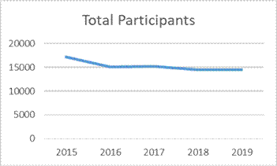
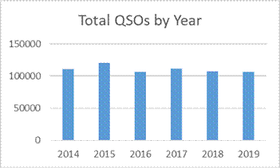
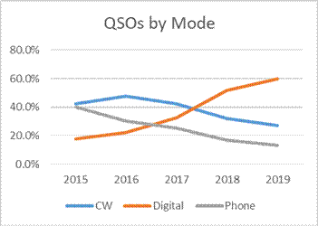
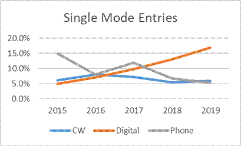

	

	&nbsp;&nbsp;&nbsp;&nbsp; At
	the end of last year, I was asked to make some predictions about the 2019 DX
	Marathon.&nbsp; That seemed like a simple request, so I predicted that we would
	have about 10% fewer participants, as much as a 20% drop in total QSO’s and
	only a few minor records would be broken – I could not have been more
	wrong!!! &nbsp;When the numbers were tallied, it showed that participant and log
	levels were identical with last year and QSO numbers were only slightly
	under last year. Participation increased in Europe and North America
	although there was a drop in participation from South America.&nbsp; New
	records?&nbsp; We had an almost 50% increase in new all-time records!&nbsp;&nbsp; 2019 was
	an incredible year considering we had some of the worst band conditions in
	many years.&nbsp; The DX Marathon is really helping to keep the bands active.&nbsp;
	Almost more amazing is that the average score of all participants, across
	all classes, bands and modes increased by 17% over 2018!&nbsp;&nbsp;&nbsp; It is truly
	amazing that even poor band conditions can produce some incredible results.&nbsp;
	Figures 1 and 2 show that overall DX Marathon participation remains strong
	despite the lack of sunspots.

	

	&nbsp;

	
&nbsp;&nbsp;&nbsp;&nbsp;&nbsp;&nbsp;&nbsp;&nbsp;

	
&nbsp;&nbsp;&nbsp;&nbsp;&nbsp;&nbsp;&nbsp;&nbsp;&nbsp;&nbsp;&nbsp;&nbsp;&nbsp;&nbsp;&nbsp;&nbsp;&nbsp;&nbsp;&nbsp;
	FIGURE 1&nbsp;&nbsp;&nbsp;&nbsp;&nbsp;&nbsp;&nbsp;&nbsp;&nbsp;&nbsp;&nbsp;&nbsp;&nbsp;&nbsp;&nbsp;&nbsp;&nbsp;&nbsp;&nbsp;&nbsp;&nbsp;&nbsp;&nbsp;&nbsp;&nbsp;&nbsp;&nbsp;&nbsp;&nbsp;&nbsp;&nbsp;&nbsp;&nbsp;&nbsp;&nbsp;&nbsp;&nbsp;&nbsp;&nbsp;&nbsp;&nbsp;&nbsp;&nbsp;&nbsp;&nbsp;&nbsp;&nbsp;&nbsp;&nbsp;&nbsp;&nbsp;
	FIGURE 2

	

	&nbsp;

	

	With the lack of
	sunspots, DX signals are weaker, but the multitude of digital modes have
	allowed anyone to work DX. The weak signal capability of the digital modes
	has kept activity high in the DX Marathon.&nbsp; Digital modes accounted for 60%
	of all QSOs in the Marathon – an incredible increase from less than 20% in
	2015.&nbsp;&nbsp; The FT4 and FT8 modes accounted for most of those digital contacts.
	As a result, Phone contacts have dropped to only 16% of the total QSOs
	submitted.&nbsp; CW has fallen as well but only by a few percentage points.&nbsp;
	Figure 3 shows the change over the last few years.&nbsp;&nbsp; As a result
	of the growing interest in FT8/FT4, we also had an increase in the number of
	participants seeking single mode awards, specifically digital.&nbsp;&nbsp; See
	Figure 4.&nbsp; With almost 20% of all participants going after the Digital only
	award, competition was significant.

	
&nbsp;

	

	
	&nbsp;&nbsp;&nbsp;&nbsp;&nbsp;&nbsp;

	
&nbsp;&nbsp;&nbsp;&nbsp;&nbsp;&nbsp;&nbsp;&nbsp;&nbsp;&nbsp;&nbsp;&nbsp;&nbsp;&nbsp;&nbsp;&nbsp;&nbsp;&nbsp;&nbsp;&nbsp;
	FIGURE 3&nbsp;&nbsp;&nbsp;&nbsp;&nbsp;&nbsp;&nbsp;&nbsp;&nbsp;&nbsp;&nbsp;&nbsp;&nbsp;&nbsp;&nbsp;&nbsp;&nbsp;&nbsp;&nbsp;&nbsp;&nbsp;&nbsp;&nbsp;&nbsp;&nbsp;&nbsp;&nbsp;&nbsp;&nbsp;&nbsp;&nbsp;&nbsp;&nbsp;&nbsp;&nbsp;&nbsp;&nbsp;&nbsp;&nbsp;&nbsp;&nbsp;&nbsp;&nbsp;&nbsp;&nbsp;&nbsp;&nbsp;&nbsp;&nbsp;&nbsp;&nbsp;
	FIGURE 4

	

	&nbsp;&nbsp;&nbsp;&nbsp;&nbsp;&nbsp;&nbsp;&nbsp;&nbsp;&nbsp;&nbsp;&nbsp; The
	maximum possible score in 2019 was 327, a slight drop of 6 entities from
	2018, but still very impressive considering the band conditions.&nbsp; Even with
	the drop in the maximum possible score, 30 All-time records were broken!&nbsp;&nbsp;
	Some happy hams now have their calls in the DX Marathon record books.&nbsp; The
	new records were quite varied with only seven of the 30 new records related
	to Digital.&nbsp; As expected, the top scores on the higher HF bands were low,
	but for the first time, the top 160 meter score was higher than the top
	scores on the 6, 10, 12 and 17 meter bands! 

	

	&nbsp;&nbsp;

	
<b>
	And the Winners Are….</b>

	

	Winning the DX
	Marathon takes a lot of time and patience.&nbsp; Missing a single entity can
	cause a lot of frustration.&nbsp; Serge, R6YY, has been a big supporter of the DX
	Marathon for years and has placed in the Top 5 of Unlimited Class for each
	of the last 4 years.&nbsp; 2019 was the magic year for Serge and his total score
	of 322 placed him number one in Unlimited Class!&nbsp; In second place was
	Marvin, VE3VEE, with a score of 321 – done completely on 20 meters!&nbsp;&nbsp; Oms,
	PY5EG and Eduard, OM3EY, both previous DX Marathon winners, tied for third
	at 317.&nbsp; John, K2ZJ, finished in 5th place at 315, improving from
	last year’s 6th place finish.&nbsp;&nbsp; Only 3 points separated the
	finishers in positions 6 through 15!

	

	&nbsp;In the Limited
	Class category, congratulations to Jim, K1PTF, who moved from Unlimited
	Class in 2018 to Limited in 2019 and took the top spot with a score of 288.&nbsp;
	Jim uses a hex beam plus wire antennas.&nbsp; Second and third place positions
	went to E76C at 279 and TA4RC at 276.&nbsp; In Formula Class, 100 watt option,
	the winner is once again James, K2JL, with a very impressive score of 297
	points!&nbsp;&nbsp; Jim was the Formula Class winner last year and increased his score
	from last year.&nbsp; Karel, OK2FD, came very close to Jim in second place with a
	score of 295.&nbsp; Karel was last year’s winner in the 5 Watt category.&nbsp; Working
	the Marathon with wire antennas is a real challenge with no sunspots.&nbsp;&nbsp; Even
	more difficult is working DX&nbsp; with QRP power.&nbsp;&nbsp; Surprisingly, we saw a big
	increase in the number of QRP submissions in 2019.&nbsp;&nbsp; Congratulations to
	Milan, OK2AP, for winning the QRP category with an impressive score of 279
	points!&nbsp; Bruno, ON6QRP, finished in second place with a score of 238.

	

	Each year about
	25% of the DX Marathon participants choose to submit scores for a single
	mode.&nbsp; In 2019 there was an overall increase in single mode submissions,
	including a big jump in Digital only submissions along with an increase in
	CW submissions.&nbsp; Phone only submissions continue to fall. &nbsp;Lada, OK2PAY,
	continues his love of CW and is now a five-time CW plaque winner.&nbsp; Lada
	topped the world with his CW only score of 311.&nbsp; Dick, PA3FQA, came in
	second with a very impressive score of 289. The top North America CW score
	went to Norm, W4QN, who is a consistent Top 5 finisher. Both Lada and Norm
	will soon hold a beautiful DX Marathon plaque for their efforts.&nbsp; The
	Digital only category again saw increases in total scores, coming very close
	to the top CW scores and easily surpassing the top Phone scores.&nbsp; The
	ability of FT8 to work with weak signals clearly was responsible for the
	score increases.&nbsp; This year’s Digital winner is no stranger to finishing at
	the top.&nbsp; Bill, K2TQC, the Unlimited Class winner for the last two years,
	decided to concentrate on Digital for 2019 and came out on top with a score
	of 307.&nbsp; In addition, he set a new all-time high score for Digital only
	submissions.&nbsp;&nbsp; Last year’s Digital winner Jan, OM5XX, came in second at 298
	points.&nbsp; Phone only submissions continue to fall, but the top two scores
	were separated by only one point!&nbsp; Gert, PA2LO, who has finished second the
	last two years moved to the number one position with a score of 269.&nbsp;
	&nbsp;Julio, W4HY, came in second at 268.&nbsp; Thanks for keeping Phone DX alive!

	

	
	&nbsp;In
	addition to the overall and Mode plaques, each year we award plaques to the
	top score on each Continent plus the highest score on each of the 10 through
	80 meter bands. &nbsp;Top honors for Africa went to CT3MD with his top score of
	292.&nbsp; The next four positions all went to ZS stations – nice the see the
	activity from Africa.&nbsp; In Asia, JE1FQV, with a score of 310, narrowly beat
	last year’s winner JA0DAI by only one point.&nbsp; The battle for the European
	top score is always close but R6YY and OM3EY always seem to be fighting for
	the top spot.&nbsp; This year R6YY, our Unlimited Class winner finished on top at
	322, closely followed by last year’s winner, OM3EY, at 317.&nbsp; In Oceania,
	YB5QZ took top honors with a score of 310, after finishing second last
	year.&nbsp; ZL2IFB finished in second with a score of 294.&nbsp; The North America
	plaque this year is awarded to Marvin, VE3VEE, who not only finished number
	one in North America with a score of 321 but also had the top 20 meter
	score.&nbsp; Marvin will add to his collection of DX Marathon plaques.&nbsp; K2ZJ came
	in second at 315.&nbsp; Oms, PY5EG, one of the top DX Marathon winners since the
	beginning of the Marathon, took home top South America honors with a score
	of 317.

	

	About 10% of DX
	Marathon participants submit single band scores each year and 2019 was no
	different.&nbsp; For the 2019 single band competitions, there were very few
	entries for the 10, 12, 15, 17 bands, but the winners for those four bands
	were all from Brazil!&nbsp; 10 meters was won by PY2TMV with an amazing score of
	142!&nbsp; PY2LCD had the top 12 meter score of 160.&nbsp;&nbsp; The 15 meter winner was
	PU2WSQ with his winning score of 243, narrowly beating PU2WDF at 239 – a
	repeat of last year’s top two positions.&nbsp; Top score on 17 was from PY2TUA
	with a total of 196 points.&nbsp; VE3VEE was once again the king of 20 meters
	with the very good score of 321.&nbsp; 20 meters was the hot band for 2019, as
	Marvin’s 20 meter only score put him in 2nd place overall worldwide.&nbsp; EA1DR
	switched to 30 meters this year and continued his winning ways with the top
	score of 270.&nbsp; PP5JR and W9KNI had a tie score of 289 for 40 meters.&nbsp; In a
	tie situation, the winner is determined by the earliest date of the last
	point scored.&nbsp; PP5KR will win the 40 meter plaque for 2019.&nbsp; Bob, W9KNI,
	came very close to continuing his 40 meter win streak and we congratulate
	both on their excellent 40 meter scores.&nbsp; The 80 meter plaque was won by
	PY7DJ with a very impressive score of 247.&nbsp; AA9A came in second at 205.
	&nbsp;Congratulations to all &nbsp;the single Band plaque winners.&nbsp; The top 160 meter
	score of 214 will earn K9RX a nice certificate for taking top honors on top
	band.&nbsp; I4EAT was once again king of 6 meters with his score of 130.&nbsp; New in
	2019 were two submissions for 60 Meter single band.&nbsp; We want to recognize
	W1NG who took top honors on 60 with a score of 156.&nbsp; Later this year we plan
	to formally announce DX Marathon awards for the 60 Meter band.

	

	In addition to
	the 2019 Plaque winners, we will award 110 Certificates of Achievement for
	various categories.&nbsp;&nbsp; Please consult the listings for the calls of the
	certificate winners.&nbsp; Certificates are awarded for the highest 6 meter and
	160 meter scores, top Continental score for each of the three modes, top
	score in each country, top score in each CQ zone, top score in each Canadian
	call district, top score in each USA call area for each of the four DX
	Marathon classes plus the top single mode score in the USA.&nbsp; Congratulations
	to all the 2019 certificate winners!

	

	Despite the
	conditions, 30 All-time records were broken in 2019.&nbsp; New records included
	nine new country records, seven new USA Call Area records, six new
	Continental mode records, three new Zone records, three new USA Mode
	records, a new 160 meter record and a new Digital record.&nbsp; Even with reduced
	conditions, breaking records is still very possible.&nbsp;&nbsp; 

	

	In the popular
	Club competition, the CDR Group in Brazil once again took top honors with an
	aggregated score of 10,597.&nbsp; &nbsp;The battle for second place was very close,
	with the Araucaria DX Group beating the Northern Illinois DX Association by
	only 33 points.&nbsp; NIDXA is the sponsor of the top three DX Marathon plaques.
	Don’t forget to include your club name on your 2020 DX Marathon submission.

	

	Each year the DX
	Marathon website publishes a large amount of information to help
	participants minimize errors in their submissions.&nbsp; The Helpful Hints page
	can be accessed from the DX Marathon home page.&nbsp; In 2019, we published
	approximately 1,300 callsign exceptions and notes to help every participant
	reduce the number of errors in their submissions.&nbsp;&nbsp; We also recommend that
	you regularly update your logging program callsign database if it has one.
	Unusual callsign prefixes seem to multiply every year, so updating your
	program’s database is critical to properly determine the DX location and/or
	Zone. 

	

	In 2019, the
	number of participants with no errors was about the same as 2018 - 22%, but
	we did see a significant drop in the overall QSO error rate to 1.5% - the
	lowest ever recorded in the DX Marathon since electronic scoring was
	initiated.&nbsp;&nbsp; Perhaps more participants are using the information we provide
	on the DX Marathon website, plus there is less chance of callsign errors
	when operating on FT8.&nbsp; The highest error category in 2019 was Wrong Zone at
	almost 29% of all errors. &nbsp;This is a significant increase from 2018.&nbsp;
	Confusion with USA Zones is one of the biggest sources of Zone errors.&nbsp; It
	is very important to note that USA callsign numbers are no longer required
	to match their QTH.&nbsp; A W6 could be in New York, or a KL7 could be in Puerto
	Rico.&nbsp; In addition to the USA, there are many special callsigns in Russia
	that do not follow the traditional callsign mapping, thus creating many
	errors in zones 16,17,18 and 19.&nbsp; Zone 2 also continues to be a problem.&nbsp;
	Very few VE2 stations are located in Zone 2 – most are in Zone 5.&nbsp; The DX
	Marathon website does list the most active Zone 2 stations. &nbsp;The next
	highest category was Invalid Callsigns – callsigns that were entered by
	participants, but do not actually exist.&nbsp; These callsign errors were 25% of
	all errors.&nbsp;&nbsp; Wrong Country accounted for 24% of all score reductions, a
	nice drop from 2018.&nbsp; Busted Calls remained at the 19% level. There were
	many unique callsigns used in 2019 so it is critical to review your DX
	Marathon submission carefully.&nbsp; The number of bad spots on the DX Clusters
	remains a big problem.

	

	&nbsp;When logging a
	QSO from a DX spot, listen carefully to the DX station to make sure the
	callsign is logged correctly.&nbsp; 45% of all point subtractions were due to
	Busted or Incorrect callsigns.&nbsp; Some Invalid callsigns may have been busted
	calls that were so bad that we could not determine the real callsign.&nbsp; Once
	again there were many mix-ups between “0” (Zero) and “O” (Oh).&nbsp; The computer
	is not forgiving, so check your log carefully!&nbsp; There are also mix-ups in
	Dates, with different parts of the world using different Date formats.&nbsp; The
	database that is used for scoring the DX Marathon includes start and end
	dates for all major expeditions, so please make sure that dates and times
	are properly logged along with the callsign, country and zone for each QSO.&nbsp;
	Not In Log reductions dropped from 2018.&nbsp; With more logs being posted
	online, it is easy to check if you are in the log before entering that QSO
	in the DX Marathon. We do publish a lot of helpful information on the DX
	Marathon website, but there is nothing we can do to make sure you are in the
	log.&nbsp; 

	

	As part of this
	issue you will find a complete listing of all scores plus a listing of the
	Top Scores in all available categories.&nbsp;&nbsp; The DX Marathon website will
	include additional information and details on the 2019 results plus photos
	of plaque winners as they become available.&nbsp; For any questions or comments
	about the DX Marathon, please contact the author.&nbsp; Thank you for your
	participation in 2019 and best of luck in 2020.

 
&nbsp;
&nbsp;

