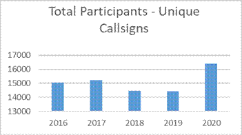
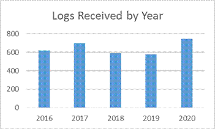
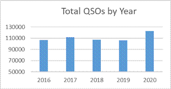
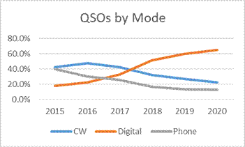

{}
Download a PDF of the full article [here](./2020%20DX%20Marathon%20Results.pdf).
{}

_A good distraction to the troubles of 2020_ – **VK4CC**

_I really enjoyed the challenge_ – **M0XLT**

_Lots of fun as usual_ – **KI1U**

_Great contest and a lot of fun!_ – **WD9DZV**

_First time CQ Marathon_ – **AF9W**

_Considering 2020 was such a lost year, CQ Marathon is always such fun_ - **N7RD**

_A tough year on and off the radio_ – **ZL2IFB**

_Working from home had its advantages this year_ – **N9TF**

_DXpeditions and sunspots were missing this year, but I still enjoyed it_ – **IK5FKF**

The DX Marathon
is alive, well and breaking records! Despite poor band conditions, the lack
of DXpeditions after February, the pandemic and many other problems facing
us, the DX Marathon had its biggest year ever in 2020! Most of us stayed
home and really appreciated the value of communication through amateur
radio. Although there were 19 fewer countries available to work, the
average country count was only down by 14 from 2019. Overall participation
was up significantly along with the number of total QSOs, despite the
average scores being lower due to lack of DXpeditions. The DX Marathon kept
us busy concentrating on DX and was a great way to reduce stress from the
pandemic. The participation graph shows the amazing growth in
2020. Total participants in the DX Marathon increased to over 16,400,
highest total in the last 5 years and a 14% increase over 2019. We
also had a record number of logs submitted and the highest ever number of
total QSOs as shown in the graphs below.

During low sunspot periods DX signals are weaker, but the
multitude of digital modes have allowed anyone to work DX. The weak signal
capability of the digital modes has kept activity high in the DX Marathon.
Digital modes accounted for 65% of all QSOs in the Marathon – an incredible
increase from less than 20% in 2015. The FT4 and FT8 modes accounted for
most of those digital contacts. The Mode graph shows the change over the
last few years.

The maximum possible score in 2020 was 308, a big drop of 19 entities from
2019, but still very impressive considering the world situation. Not a
single person scored over 300 – another unfortunate result of the pandemic.
We were surprised to see that 10 All-time records were broken! Some happy
hams now have their calls in the DX Marathon record books. Setting new
records in the 2020 environment is a real accomplishment. In terms of band
usage, the higher bands saw big increases in QSOs.

# And	the Winners Are…

For the last few years, John, K2ZJ, has been among the top scorers and placed 5th
in 2019. 2020 was a great year for John as he took top honors in Unlimited
Class with a score of 297. Competition was tough but John did not make a
single error in his log which put him above his competition. Building on
this unusual year, we had a tie for 2nd place from Japan!
Veteran JA2NDQ and newcomer JH1AJT were tied at 294. Nice to see Zorro
place so well in his first year of competition. Previous winners PY5EG and
R6YY placed 4th and 5th respectively.

James, K2JL, winner of Formula Class the last 2 years made the jump to Limited Class in
2020 and came out on top with a score of 267. James installed a new HexBeam
for his change to Limited Class. Second and third place positions went to
IK2RPE and TA4RC, with scores of 259 and 252, respectively. TA4RC repeated
his 3rd place performance from last year. In Formula Class,
100-watt option, Karel, OK2FD, was our winner with a score of 263. For wire
antennas, 100 watts and often poor conditions, this was a great
accomplishment. Karel was 2nd last year. IU0LFQ and YV5OIE
finished 2nd and 3rd respectively. Working the
Marathon with wire antennas is a real challenge with no sunspots. Even
more difficult is working DX with QRP power. Congratulations to Milan,
OK2AP, for a repeat win in the QRP category with an impressive score of 260
points! CO2QU finished in second place with a score of 198.

Each year about	25% of the DX Marathon participants choose to submit scores for a single
mode. In 2020 we saw a slight decrease in Digital only submissions, but a
30% increase in Phone only submissions, reversing the Phone downward trend
from the last few years. Lada, OK2PAY, continues his love of CW and is now
a six-time CW only plaque winner! Lada topped the world with his CW only
score of 274. Saulius, LY5W, came in second with a very impressive score of
269. The top North America CW score went to Dan, KB0EO with a score of 266.
Both Lada and Dan will soon hold a beautiful DX Marathon CW plaque for
their efforts. The Digital only category continues to show big scores with
the winner, Janos, HA1RB, finishing just 4 points less than the top CW score
at 270. DX Marathon veterans OM5XX and IK2RPE finished 2nd and 3rd
respectively with scores of 265 and 259. A lot of competition for the
Digital only plaque! Phone only submissions were up this year although
average scores were quite a bit below the CW and Digital scores. Julio,
W4HY, who finished second last year moved to the number one position with a
score of 240. PY5QW came in second at 222. Thanks for keeping Phone DX
alive!

In addition to the overall and Mode plaques, each year we award plaques to the top score on
each Continent plus the highest score on each of the 10 through 80-meter
bands. Top honors for Africa went to repeat winner CT3MD with his top score
of 269 with second place to EA8DHH with a score of 241 and 3rd
place went to ZS2EZ with a score of 238. In Asia, it was a real contest
between JA2NDQ and first time DX Marathon participant JH1AJT. Each scored
294 points. In the case of a tie, the winner goes to the participant with
the earliest date of their last valid QSO. Congratulations to Hiro, JA2NDQ
for earning the Asia plaque. JA0DAI came in 3rd at 279 points.
In Europe, last year’s overall Unlimited Class winner, Serge, R6YY, came in
first with an impressive score of 293. DJ3AA finished second at 284. In
Oceania, Anton, YB5QZ, once again took top honors with a score of 280 very
closely followed by a previous Oceania winner, VK3GA, at 279. The top North
American score was by K2ZJ at 297, who was the Unlimited Class plaque
winner. Pete, N0FW came in second at 288. Oms, PY5EG, one of the top DX
Marathon winners since the beginning of the Marathon, took home top South
America honors with a score of 293.

About 10% of DX	Marathon participants submit single band scores each year and 2020 was no
different. For 2020 we added the 60-meter band as well. However, the Band
mix was quite different this year. For the 2020 single band competitions,
we saw a big increase in 10, 15 and 20 meter only band submissions, while
there was a decrease in 30 and 80 meter only submissions. Clearly the new
sunspots were welcomed by all. 10 meters was won by 9A2EU with an amazing
score of 183! PY2TC had the top 12-meter score of 205. The 15-meter winner
was PY2LCD at 247 points. Top score on 17 was from LY5O with a total of 241
points. Despite the lack of DXpeditions, the top scores on the 10, 12, 15
and 17 meter bands were all significantly higher than in 2019. VE3VEE was
once again the king of 20 meters with his top score of 287. 20 meters was
once again the hot band for 2019, as Marvin’s 20 meter only score put him in
7th place overall worldwide. DL7JAN took top 30-meter honors with a score
of 187. PP5JR once again took the top 40-meter spot with a score of 263.
He was followed closely by W9KNI with his score of 255, which was done
without using the new digital modes – a very impressive accomplishment.
Starting in 2020, we are now awarding a Single Band plaque for the 60-meter
band. This inaugural plaque was won by Ken, W1NG, with a very impressive
score of 183! The 80-meter plaque was won by N3QE with a score of 157.
Congratulations to all the single Band plaque winners. The impressive
160-meter score of 187 will earn LA3MHA a nice certificate for taking top
honors on top band. I4EAT was once again king of 6 meters with his score of
146.

In addition to the 2020 Plaque winners, we are awarding 98 Certificates of Achievement for
various categories. Please consult the detailed listings for the calls of
the certificate winners. Certificates are awarded for the highest 6 meter
and 160-meter scores, top continental score for each of the three modes, top
score in each country, top score in each CQ zone, top score in each Canadian
call district, top score in each USA call area for each of the four DX
Marathon classes plus the top single mode score in the USA. Congratulations
to all the 2020 certificate winners!

Despite a big drop in the maximum possible score due to the lack of DXpeditions, Ten
All-time records were broken in 2020! New records included two new country
records, four new USA Call Area records, two new Continental mode records,
and new records on the 6- and 60-meter bands. Even with reduced DX activity,
breaking records is still very possible.

In the popular Club competition, the CDR Group in Brazil once again took top honors with an
aggregated score of 10,557. The battle for second place was remarkably
close, with the Northern Illinois DX Association moving into second place by
beating the Rio DX Group by just 6 points. NIDXA is the sponsor of the top
three DX Marathon plaques. Don’t forget to include your club’s name on your
2021 DX Marathon submission.

## Some	Operating Advice…

Each year the DX Marathon website publishes a large amount of information to help
participants minimize errors in their submissions. The Helpful Hints page
can be accessed from the DX Marathon home page. In 2020, we published over
1,000 callsign exceptions and notes to help every participant reduce the
number of errors in their submissions. We also recommend that you
regularly update your logging program callsign database if it has one.
Unusual callsign prefixes seem to multiply every year, so updating your
program’s database is critical to properly determine the DX location and/or
Zone.

In 2020, the number of participants with no errors increased from 22% in 2019 to 25% in
2020. We were happy to see the improvement, but 75% of our entrants made at
least one error. Unfortunately, the overall error rate for those who did
make mistakes increased to 1.7% from 1.5% in 2019. The highest error
category was once again Wrong Zone which accounted for 1/3 of all errors
made. The Wrong Zone error rate continues to increase each year. Confusion
with USA Zones is one of the biggest sources of Zone errors. It is
especially important to note that USA callsign numbers are no longer
required to match their QTH. A W6 could be in New York, or a KL7 could be
in Puerto Rico. In addition to the USA, there are many special callsigns in
Russia that do not follow the traditional callsign mapping, thus creating
many errors in zones 16,17,18 and 19. Zone 2 also continues to be a
problem. Very few VE2 stations are in Zone 2 – most are in Zone 5. The DX
Marathon website does list the most active Zone 2 stations. The next
highest category was Invalid Callsigns – callsigns that were entered by
participants, but do not actually exist. These callsign errors were 25% of
all errors. Wrong Country accounted for 23% of all score reductions.
Busted Call errors dropped from last year to 16%. There were many unique
callsigns used in 2020 so it is critical to review your DX Marathon
submission carefully. The number of bad spots on the DX Clusters remains a
big problem.

When logging a QSO from a DX spot, listen carefully to the DX station to make sure the
callsign is logged correctly. 41% of all point subtractions were due to
Busted or Incorrect callsigns. Some Invalid callsigns may have been busted
calls that were so bad that we could not determine the real callsign. Once
again there were many mix-ups between “0” (Zero) and “O” (Oh). The computer
is not forgiving, so check your log carefully! The database that is used
for scoring the DX Marathon includes start and end dates for all major
expeditions, so please make sure that dates and times are properly logged
along with the callsign, country and zone for each QSO. NIL (Not In Log)
reductions more than doubled in 2020. With more logs being posted online,
it is easy to check if you are in the log before entering that QSO in the DX
Marathon. We do publish a lot of helpful information on the DX Marathon
website, but there is nothing we can do to make sure you are in the log.

As part of this article, you will find a complete listing of all scores plus a listing of
the Top Scores in all available categories. The DX Marathon website will
include additional information and details on the 2020 results plus photos
of plaque winners as they become available. For any questions or comments
about the DX Marathon, please contact the author.

## Special Thanks…

The DX Marathon	would not be possible without the incredible help and assistance from so
many people. The team effort makes the DX Marathon possible. I want to
first thank CQ Magazine for developing the Marathon and providing continuing
support. One of the first hams to jump in was Alex, VE3NEA, who has
created the DX Marathon scoring software. He continues to provide updates
as required. Without his software, there would not be a DX Marathon. A
special thanks goes to Jim, AD1C, who has created the very popular ADIF to
DX Marathon software used by almost 70% of all entrants. I also thank our
many plaque sponsors who make our winners incredibly happy each year. Mike,
ND9G, wrote our online submission and log checking tool for which we are
grateful. Dave, AA6YQ, has created powerful DX Marathon tracking tools in
his DX Labs software which we really appreciate. John, W9ILY, creates the
DX Marathon certificates – thank you, John. A special thank you goes to
W9KNI and PY5EG for their incredible support of the Marathon and their
constant encouragement over the years. Bernie, W3UR, has also been a
tremendous supporter by including lots of DX Marathon in his Daily DX
newsletter. I also thank Laurie, VK3AMA, for including DX Marathon support
in his popular JT Alert software. Of course, none of this would be
possible without you – our valuable readers and participants in the DX
Marathon. Thank you for your participation in 2020 and best of luck in 2021!
